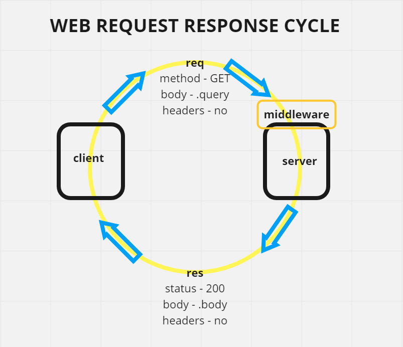

# basic-express-server

a basic Express server using best practices, including server modularization, use of middleware, and tests

## Author: Fizzo Pannosch

**Version**: 1.0.0

<!-- (increment the patch/fix version number if you make more commits past your first submission) -->

### 
 links and resources 

#### 
 [heroku deployed site](https://fizzo-basic-express-server.herokuapp.com/person?name=Fizzo) 

<!-- #### 
 [github actions](https://github.com/fizzo999/server-deployment-practice/actions) 
 -->

<!-- #### 
 [github pull request](https://github.com/fizzo999/server-deployment-practice/pull/1) 
 -->

#### 
 [ci/cd - github](https://github.com/fizzo999/basic-express-server/actions/runs/769507085) 

#### 
 [merged pull request - github](https://github.com/fizzo999/basic-express-server/pull/2) 

<!--  -->

## 
 UML DIAGRAM 

## Overview

building a basic express server with node.js. Writing our own tests with supertest and jest.

## Setup

git clone repo from github link:
https://github.com/fizzo999/basic-express-server.git

.env requirements
PORT - Port Number

npm install
(to install dependencies: express, dotenv, supertest, jest)

Running the app
npm start
Endpoint: /person&name=YOU_FILL_IN_THE_BLANK

Returns Object

{ "name": "YOU_FILL_IN_THE_BLANK" }

Tests
Unit Tests: npm run test

## Architecture

node.js based server that uses express library and dotenv package
tests performed with jest and supertest

## Change Log

04-20-2021 9:59pm - Application now has a fully-functional express server, with GET route ('/person?name=ANYTHING_REALLY') to /person endpoint with query string name=YOU_FILL_IN_THE_BLANK.

## Credits and Collaborations

thank you Dan Engel, Lydia Minehan-Tubic and Yuliya Barysevich for help with individual steps on this.

Number and name of feature: setup file structure, write server.js, index,js, 404.js, 500.js, test.js.yml - repo on github and deploy to heroku
Estimate of time needed to complete: 2 hours
Start time: 3:00 pm
Finish time: 6:00 pm
Actual time needed to complete: 3 hours

Number and name of feature: bug fix, readme.md, wrrc diagram
Estimate of time needed to complete: 2 hours
Start time: 8:00 pm
Finish time: 10:00 pm
Actual time needed to complete: 2 hours
